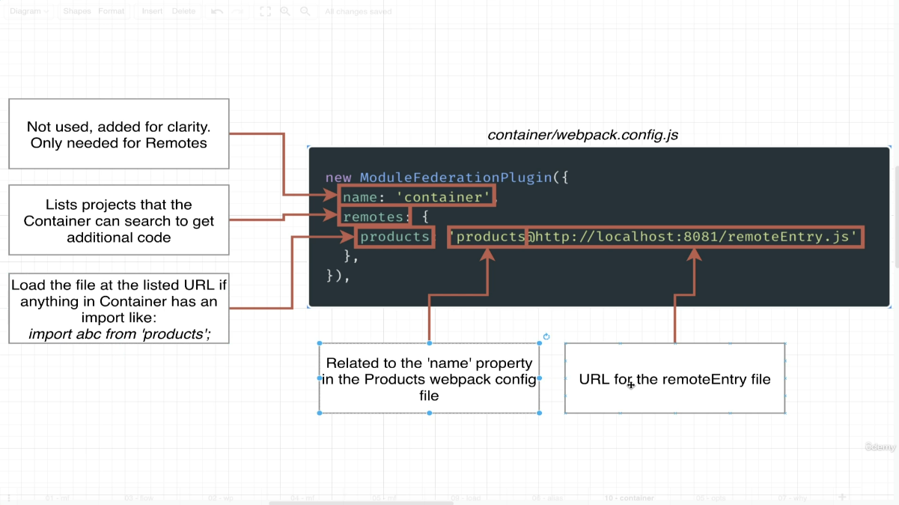
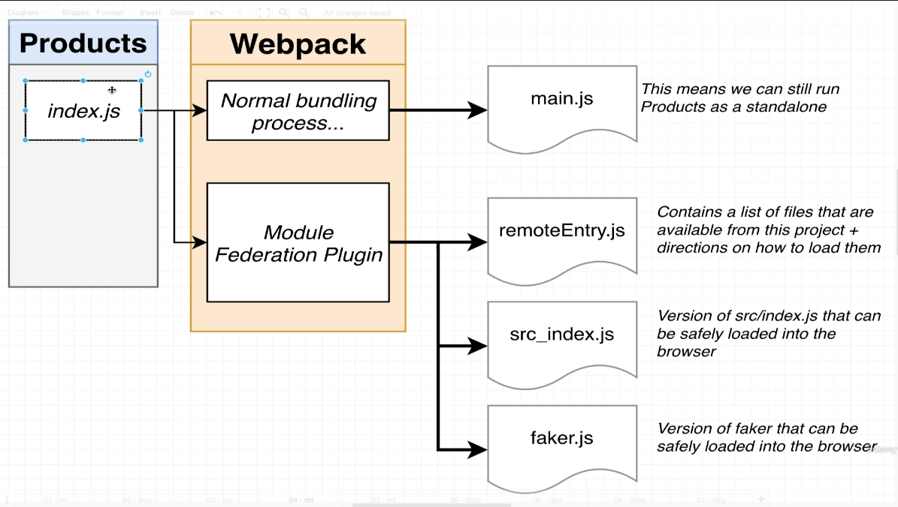
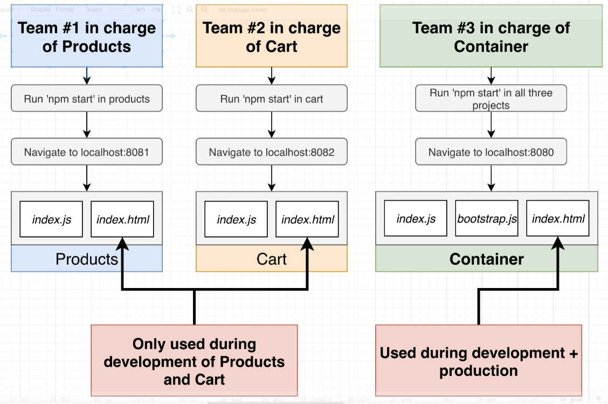

# Notes

## Section 1: The Basics of Microfrontends & Module Federation

### Setting up Product (REMOTE)

- create a `product` directory.
- set it up as a `npm project` using `npm init -y`
- install dependencies

```
npm install webpack@5.88.0 webpack-cli@4.10.0 webpack-dev-server@4.7.4 html-webpack-plugin@5.5.0 nodemon --save-exact
```

- install faker.js to mock products

```
npm i faker@5.1.0 --save-exact
```

#### Sample Webpack for REMOTE

```Javascript
// generates html file with the webpack build in the path specified in output property
const HtmlWebpackPlugin = require('html-webpack-plugin');
const ModuleFederationPlugin = require('webpack/lib/container/ModuleFederationPlugin');
module.exports = {
  mode: 'development', // or 'production' or 'none'
  devServer: {
    port: 8081,
  },
  plugins: [
    new ModuleFederationPlugin({
      name: 'products',
      filename: 'remoteEntry.js',
      exposes: {
        './ProductsIndex': './src/index',
      },
    }),
    new HtmlWebpackPlugin({
      template: './public/index.html',
    }),
  ],
};

```

### Setting up Container (HOST)

- create a `container`directory.
- set it up as a `npm project` using `npm init -y`
- install dependencies

```
npm install webpack@5.88.0 webpack-cli@4.10.0 webpack-dev-server@4.7.4 html-webpack-plugin@5.5.0 nodemon --save-exact
```

#### Sample Webpack for HOST

webpack.config.js

```Javascript
// generates html file with the webpack build in the path specified in output property
const HtmlWebpackPlugin = require('html-webpack-plugin');
const ModuleFederationPlugin = require('webpack/lib/container/ModuleFederationPlugin');
module.exports = {
    mode: 'development', // or 'production' or 'none'
    devServer: {
      port: 8080
    },
    plugins: [
        new ModuleFederationPlugin({
            name:'container',
            remotes: {
                products: 'products@http://localhost:8081/remoteEntry.js'
            }

        }),
      new HtmlWebpackPlugin ({
        template: './public/index.html'
      })
    ]
  };
```



- Designate one app as the HOST (Container) and one as the Remote (Products)
- In the Remote, decide which module (files) you want to make available to other projects.
- Set up Module Federation plugin to expose those files.
- In the HOST, decide which files you want to get from the remote.
- Set up Module Federation plugin to fetch those files.
- In the Host, refactor the entry point to load asynchronously.
- In the Host, import all the files you need from the remote.



### Why microfrontend


