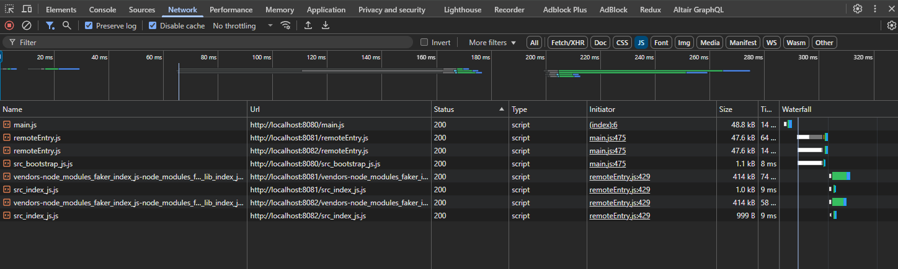

# Section 2: Sharing Dependencies Between Apps

When there are multiple apps (REMOTE) getting loaded into the container (HOST), there are chances that the remote app could be using common packages. When the HOST applications loads those packages/modules, it will be loading the same module multiple times.

For example:

lets say app1 and app2 has a commong node_module package called `xyzpackage` which is 3mb in size. When these modules are loaded into the host container `xyzpackage` will be loaded 2 times increasing the bundle size to 6mb.

Below is the screenshot with an example of duplicate package being loaded.



## Using Shared Modules

- Container fetches Products remoteEntry.js
- Container fetches Cart remoteEntry.js
- Container notices that both require and `Faker`package.
- Container can choose to load only one copy from either `Cart`or `Prodcuts`
- Single copy is made available to both `Cart` and `Products`

To fix the issues with loading multiple dependencies, we need to update the webpack.config.js file to include `shared` property in the module federation plugin for the apps using the shared modules.

example from products:

`shared: ['faker']` is added in the ModuleFederationPlugin.

```javascript
const HtmlWebpackPlugin = require('html-webpack-plugin');
const ModuleFederationPlugin = require('webpack/lib/container/ModuleFederationPlugin');
module.exports = {
  mode: 'development', // or 'production' or 'none'
  devServer: {
    port: 8081,
  },
  plugins: [
    new ModuleFederationPlugin({
      name: 'products',
      filename: 'remoteEntry.js',
      exposes: {
        './ProductsIndex': './src/index',
      },
      shared: ['faker']
    }),
    new HtmlWebpackPlugin({
      template: './public/index.html',
    }),
  ],
};
```

### ℹ️ Things to Note

When packages are shared, it will cause issues when trying to load the shared package in the isolated apps when running them individually.

For example: When trying to load the `faker` package in `products`, the app will attempt to load it immediately but fail because it is now shared via the Module Federation plugin. The package is loaded asynchronously, causing function calls that depend on it to fail with the following error message:

```text
Uncaught Error: Shared module is not available for eager consumption: webpack/sharing/consume/default/faker/faker
    at __webpack_require__.m.<computed> (main.js:1057:54)
    at __webpack_require__ (main.js:284:33)
    at fn (main.js:556:21)
    at eval (index.js:2:63)
    at ./src/index.js (main.js:211:1)
    at __webpack_require__ (main.js:284:33)
    at main.js:1677:37
    at main.js:1679:12
```

To fix this we will need to use the dynamic import to load the contents by using the following steps.

1. Create a new file called `bootstrap.js` (file name can be anything)
2. Move all the base codes for the app in the new file.
3. in `index.js` file, load bootstrap using the dynamic import
```
import ('./boostrap');
```

### Shared Module Versioning and Singleton loading

In general, the module federation will respect the semantic versioning of the packages. Meaning if the packages in the lock file are prefixed with `^` or `~`, it will only load one package for all the remote apps in the host with semantic versioning.

If the packages are not prefixed with the annotaions then the host will load all the versions that are used for the given package.

>**FOR EXAMPLE** 
>
>in products it is using `faker: '3.9.0'` and in cart its using `faker:3.11.0`. The host will load both the packages.
>
>But, if the package in product is prefixed with `faker: ^3.9.0`, the host will load `3.11.0` as the common package for both.


## Singleton Loading

There are some cases where we cannot load a single 

Below is the sample of enabling a singleton pattern for sharing dependencies between modules. This will ensure that there is only one version of `faker` in the host.

```
plugins: [
    new ModuleFederationPlugin({
      name: 'products',
      filename: 'remoteEntry.js',
      exposes: {
        './ProductsIndex': './src/index',
      },
      // shared: ['faker']
      shared: {
        faker: {
          singleton: true
        }
      }
    }),
    new HtmlWebpackPlugin({
      template: './public/index.html',
    }),
  ]
```

## Sub-App Execution Context

### Situation 1

- we are running the file in development mode in isolation
- we are using local index.html file
- which has an element with the id which will be used to load the contents.
- we want to immediately render our app into the element

### Situation 2

- we are running this file in development or production through the container app
- there is no gurantee that an element with the same name in REMOTE app exists in the HOST.
- we do not want to load the apps immediately because it will cause error.

