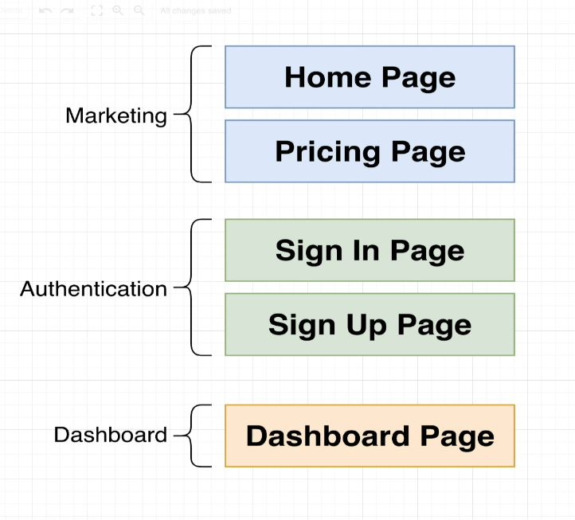
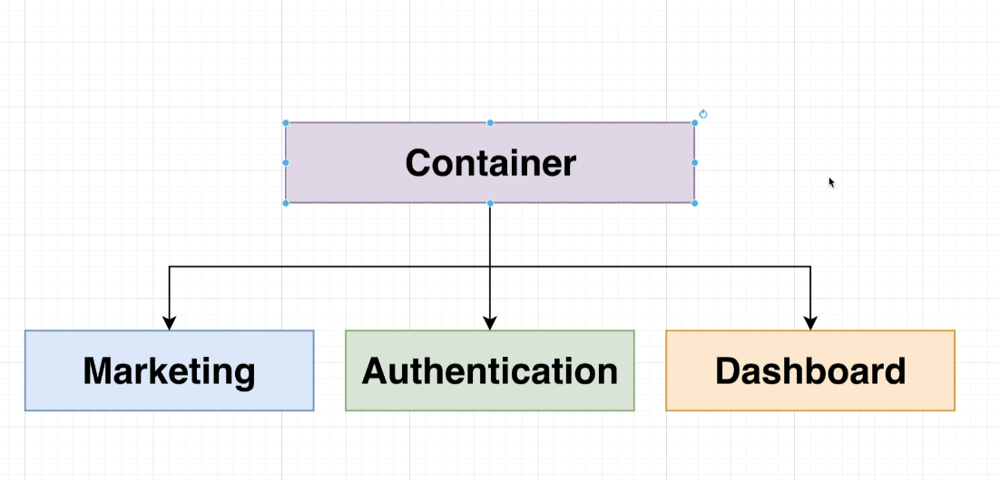

# Linking Multiple Apps

## Application Overview

## Requirements

### Requirement 1

- Zero coupling between child projects
    - no importing of functions/objects/classes/etc
    - no shared state
    - shared libraries through Module Federation is ok

### Requirement 2

- Near-zero coupling between container and child apps.
    - Container shouldn't assume that a child is using a particular framework.
    - Any necessary communication done with callbacks or simple events.

### Requirement 3

- CSS from one project shouldn't affect another.

### Reequirement 4

- Verson Control (monorepo vs separate) shouldn't have any impact on the overall project
    - Some people want to use monorepos.
    - Some people want to keep everything in a separate repo

### Requirement 5

- Container should be able to decide to always use the latest version of a microfrontend or specify a specific version

    - Option 1: Container will always use the latest version of a child app. (Does not require a redeploy of a container)
    - Option 2: Container can sepcify exactly what version of a child it wants to use (requires a redeploy to change)

