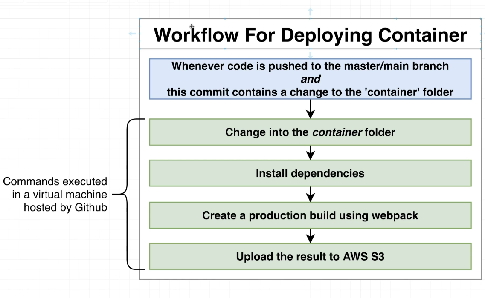

# Implementing a CI/CD pipeline

## Requirements Around Deployment.

- deploy each microfrontend independently (including the container)
- locationof the child app remoteEntry.js files must be known at build time.
- Many front-end deployment solutions assume you are deploying a single project, we need something that can handle multiple different ones.
- Need a CI/CD pipeline of some sort.
- the remoteEntry.js file name is fixed! Need to think about caching issues.

## Workflow Diagram

