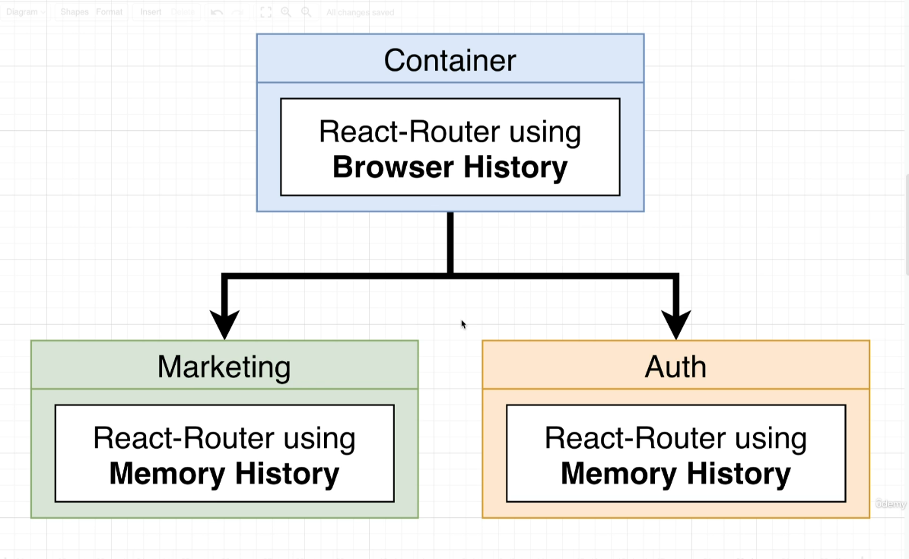
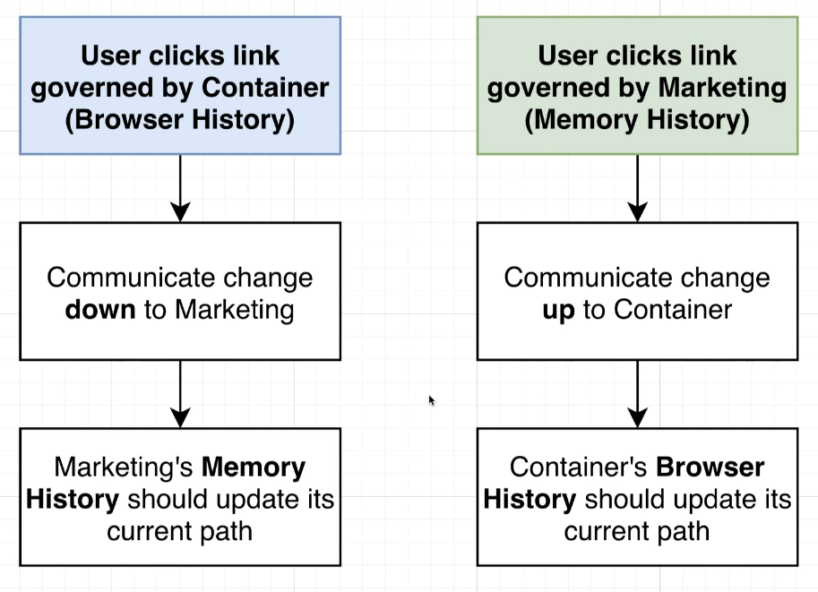

# Multi Tier Navigation

- Each app will have its own routing mechanism.
- **Host** will have `Browser History` and **Remote** will have `Memory History`. Implemening `Borowser History` inside a child app will cause issues and conflicts.

## Browser History vs Memory History.

Details on browser history and memory history can be found [here](6-1-history_comparison.md).

